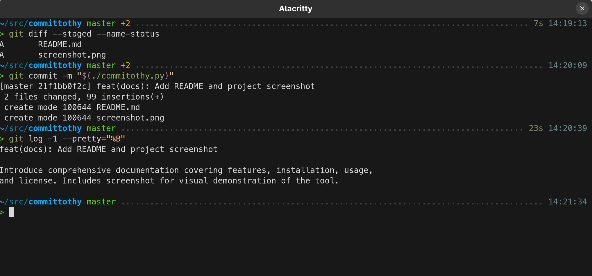

# Commitothy

**Commitothy** is a Python script that generates meaningful Git commit
messages using AI. It analyzes your staged changes and recent commit
history to produce well-formatted, context-aware commit messages in the
style of your existing project.



## Features

- ✅ Analyzes **staged Git diffs** automatically
- ✅ Learns from **recent commit messages** in your repo for style consistency
- ✅ Uses powerful LLMs via [OpenRouter](https://openrouter.ai) (support for multiple models)
- ✅ Enforces Git best practices:
  - Summary line ≤ 72 characters
  - Imperative mood ("Fix bug" not "Fixed bug")
  - Optional multi-line body with 72-character wrapping
  - Style matching (supports conventional commits, kernel style, etc.)
- 🔧 Configurable via command-line options
- 🐍 Standalone script using `uv` and `openai` – no heavy dependencies

## Installation

1. Install [`uv`](https://github.com/astral-sh/uv) (recommended) or use any
   Python 3.12+ environment.
2. Clone or download `commitothy.py` and place it on your `PATH`:
   ```bash
   curl -o commitothy.py https://raw.githubusercontent.com/mgalgs/commitothy/main/commitothy.py
   chmod +x commitothy.py
   mv commitothy.py ~/bin/
   ```
3. Set your OpenRouter API key:
   ```bash
   export OPENROUTER_API_KEY=your_api_key_here
   ```
   Get a free API key at [OpenRouter.ai](https://openrouter.ai/keys).

## Usage

Stage your changes, then run:

```bash
commitothy.py
```

The default model is
[`openrouter/auto`](https://openrouter.ai/openrouter/auto). To use a
specific model (e.g. `google/gemini-2.5-flash`):

```bash
commitothy.py --model google/gemini-2.5-flash
```

Other options:
```bash
--history-limit N     # number of recent commits to analyze (default: 20)
--num-retries N       # retry failed API calls (default: 3)
--debug               # show full prompt sent to model
```

Use with `git commit`:
```bash
git commit -m "$(commitothy.py)"
```

## How It Works

1. Collects the staged Git diff (`git diff --staged`)
2. Finds recently committed messages for the same files
3. Builds a smart prompt with code changes + style examples
4. Asks the LLM to generate a commit message matching the project's tone and format
5. Outputs clean message ready for `git commit`

## Requirements

- [`uv`](https://github.com/astral-sh/uv)
- Git
- Shell environment with `OPENROUTER_API_KEY` set

Dependencies are managed inline via [script metadata](https://packaging.python.org/en/latest/specifications/inline-script-metadata/):
```toml
requires-python = "==3.12"
dependencies = [
    "openai",
]
```

## License

MIT

---

Made with ❤️ and `#!/usr/bin/env -S uv run --script`
